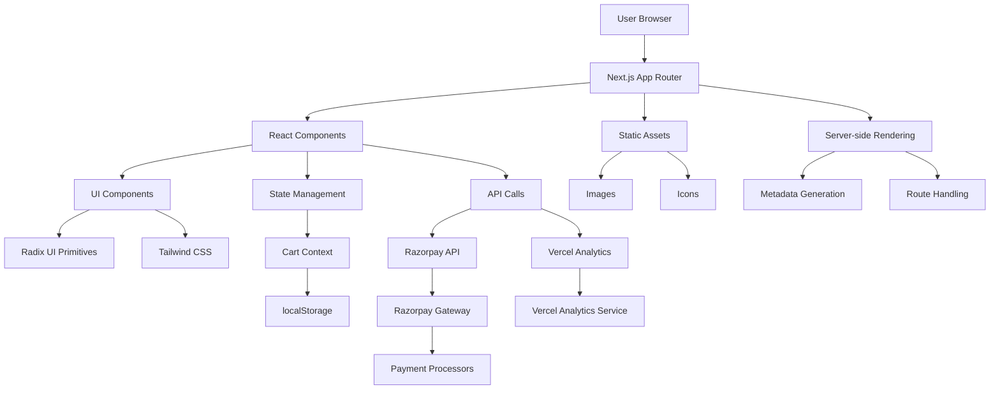

# Eco-Sip

 Everyday hydration reinvented. Smart reusable bottles made from recycled materials.

 ## Features

###  E-Commerce Functionality
- **Product Showcase** - Three distinct product lines: Core, GoCup, and Pure
- **Shopping Cart** - Persistent cart with localStorage integration
- **Quantity Management** - Add/remove items with real-time updates
- **Responsive Design** - Mobile-first approach with Tailwind CSS

###  Payment Integration
- **Razorpay Payments** - Secure payment processing with multiple payment methods
- **Test & Live Modes** - Easy switching between development and production
- **Order Confirmation** - Real-time payment success handling
- **Tax Calculation** - Automatic 10% tax inclusion

###  Modern UI/UX
- **Component-Based Architecture** - Reusable UI components with Radix UI
- **Dark/Light Theme** - Built-in theme switching capability
- **Smooth Animations** - Interactive hover effects and transitions
- **Accessibility** - Semantic HTML and proper ARIA attributes

###  Sustainability Focus
- **Eco-Friendly Products** - Made from 100% recycled materials
- **Product Ecosystem** - Three specialized hydration solutions
- **Lifestyle Integration** - Designed for modern sustainable living

##  System Architecture

